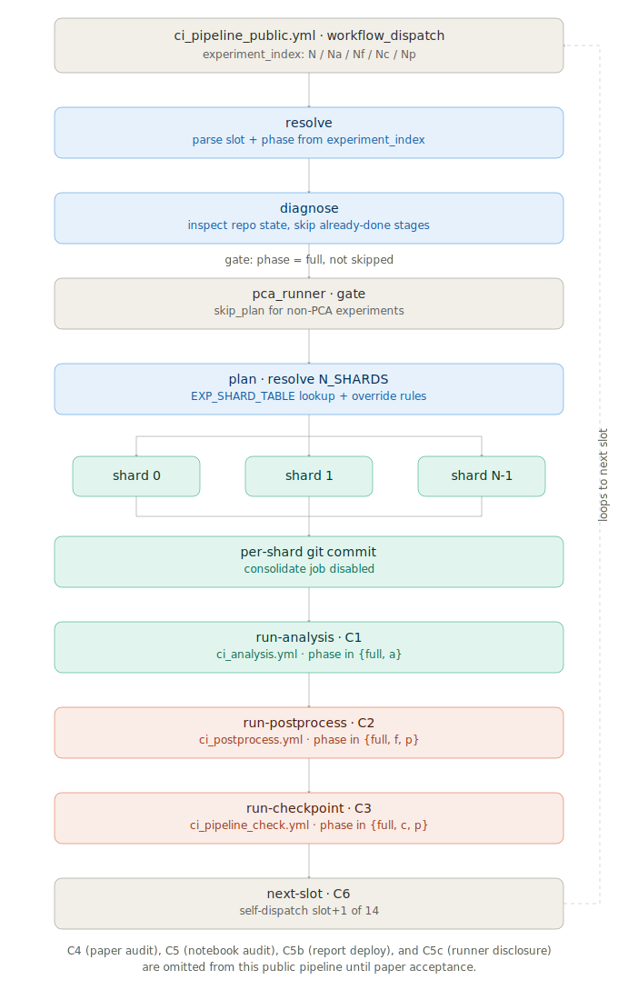

# LLM-HypatiaX-REPRO


## Structure

```
├── .github/
│   ├── scripts/
│   │   ├── check_sweep_coverage.py
│   │   ├── check_symbolic_equivalence.py
│   │   ├── clean_figures_dir.py
│   │   ├── locate_analysis_input.sh
│   │   ├── merge_extrap_into_benchmark.py
│   │   ├── merge_shards.py
│   │   ├── print_repro.py
│   │   ├── purge_figures_dest.py
│   │   ├── run_analysis.py
│   │   └── validate_analysis_input.py
│   └── workflows/
│       ├── ci_analysis.yml
│       ├── ci_pipeline_check.yml
│       ├── ci_pipeline_public.yml
│       ├── ci_postprocess.yml
│       ├── ci_runner.yml
│       ├── clean-old-workflows.yml
│       └── cleanup-cache-actions.yml
├── config/
│   └── repro.yaml
├── docs/
├── hypatiax/
│   ├── analysis/
│   │   ├── analyze_hybrid_performance.py
│   │   └── statistical_analysis.py
│   ├── core/
│   │   ├── base_pure_llm/
│   │   │   ├── baseline_pure_llm_defi_discovery.py
│   │   │   └── __init__.py
│   │   ├── generation/
│   │   │   ├── hybrid_all_domains_llm_nn/
│   │   │   │   ├── hybrid_system_llm_nn_all_domains.py
│   │   │   │   └── __init__.py
│   │   │   ├── hybrid_defi_llm_nn/
│   │   │   │   ├── hybrid_ensemble_system_defi_domain.py
│   │   │   │   └── __init__.py
│   │   │   └── hybrid_defi_system/
│   │   │       ├── hybrid_system_nn_defi_domain.py
│   │   │       └── __init__.py
│   │   ├── __init__.py
│   │   ├── metrics.py
│   │   └── training/
│   │       ├── adaptive_config.py
│   │       ├── baseline_neural_network_defi_improved.py
│   │       └── __init__.py
│   ├── experiments/
│   │   ├── benchmarks/
│   │   │   ├── exp1_ablation.py
│   │   │   ├── exp3_nguyen12_hybrid50v_02.py
│   │   │   ├── extrap_r2_far.py
│   │   │   ├── hypatiax_defi_benchmark_pca.py
│   │   │   ├── hypatiax_defi_benchmark_v3c.py
│   │   │   ├── __init__.py
│   │   │   ├── run_comparative_suite_benchmark_pca.py
│   │   │   ├── run_comparative_suite_benchmark_v2.py
│   │   │   ├── run_hybrid_system_benchmark.py
│   │   │   ├── run_instability_suite.py
│   │   │   ├── run_noise_sweep_benchmark.py
│   │   │   └── run_sample_complexity_benchmark.py
│   │   ├── __init__.py
│   │   └── tests/
│   │       └── test_enhanced_defi_extrapolation.py
│   ├── path.py
│   ├── protocols/
│   │   ├── experiment_protocol_all_30.py
│   │   ├── experiment_protocol_benchmark_v2.py
│   │   ├── experiment_protocol_defi.py
│   │   ├── experiment_protocol_nguyen12.py
│   │   └── __init__.py
│   ├── tools/
│   │   ├── __init__.py
│   │   ├── symbolic/
│   │   │   ├── hybrid_system_v50_2.py
│   │   │   ├── __init__.py
│   │   │   ├── physics_aware_regressor.py
│   │   │   ├── smart_structure_detector.py
│   │   │   └── symbolic_engine.py
│   │   ├── utils/
│   │   │   ├── __init__.py
│   │   │   └── pca_split_utils.py
│   │   └── validation/
│   │       ├── dimensional_validator.py
│   │       ├── domain_validator.py
│   │       ├── ensemble_validator.py
│   │       ├── __init__.py
│   │       └── symbolic_validator.py
│   ├── tree_rd.txt
│   └── version.py
├── scripts/
│   ├── generate_figures.py
│   ├── generate_tables.py
│   └── patches/
│       ├── generate_exp2_pca_comparison_table.py
│       ├── generate_nguyen12_symequiv_table.py
│       └── validate_analysis_input.py
├── .gitignore
├── LICENSE
├── Makefile
├── README.md
├── requirements.txt
└── run_all.sh
```

## Workflows (16)

- `.github/workflows/ci_analysis.yml` — 8 transitive dependencies
- `.github/workflows/ci_paper_audit.yml` — 4 transitive dependencies
- `.github/workflows/ci_paper_notebooks.yml` — 2 transitive dependencies
- `.github/workflows/ci_pipeline.yml` — 0 transitive dependencies
- `.github/workflows/ci_pipeline_analysis.yml` — 10 transitive dependencies
- `.github/workflows/ci_pipeline_check.yml` — 1 transitive dependencies
- `.github/workflows/ci_postprocess.yml` — 5 transitive dependencies
- `.github/workflows/ci_purge_runs.yml` — 0 transitive dependencies
- `.github/workflows/ci_report.yml` — 1 transitive dependencies
- `.github/workflows/ci_runner.yml` — 33 transitive dependencies
- `.github/workflows/ci_runner_disclosure.yml` — 23 transitive dependencies
- `.github/workflows/ci_trace_pipeline.yml` — 39 transitive dependencies
- `.github/workflows/clean-old-workflows.yml` — 0 transitive dependencies
- `.github/workflows/cleanup-cache-actions.yml` — 0 transitive dependencies
- `.github/workflows/cleanup-prs.yml` — 0 transitive dependencies
- `.github/workflows/static.yml` — 0 transitive dependencies

## File inventory (63 files)

| File | Type |
|------|------|
| `.github/scripts/locate_analysis_input.sh` | shell |
| `.github/scripts/merge_extrap_into_benchmark.py` | python |
| `.github/scripts/merge_shards.py` | python |
| `.github/scripts/run_analysis.py` | python |
| `.github/scripts/validate_analysis_input.py` | python |
| `.github/workflows/ci_trace_pipeline.yml` | config |
| `config/repro.yaml` | config |
| `hypatiax/analysis/analyze_hybrid_performance.py` | python |
| `hypatiax/analysis/statistical_analysis.py` | python |
| `hypatiax/core/base_pure_llm/baseline_pure_llm_defi_discovery.py` | python |
| `hypatiax/core/generation/hybrid_all_domains/suite_hybrid_system_all_domains.py` | python |
| `hypatiax/core/generation/hybrid_all_domains_llm_nn/hybrid_system_llm_nn_all_domains.py` | python |
| `hypatiax/core/generation/hybrid_defi_llm_guided/llm_guided_symbolic_discovery_defi.py` | python |
| `hypatiax/core/generation/hybrid_defi_system/complete_defi_hybrid_system.py` | python |
| `hypatiax/core/generation/hybrid_defi_system/hybrid_system_nn_defi_domain.py` | python |
| `hypatiax/core/training/adaptive_config.py` | python |
| `hypatiax/core/training/baseline_neural_network.py` | python |
| `hypatiax/core/training/baseline_neural_network_defi_improved.py` | python |
| `hypatiax/experiments/benchmarks/exp3_nguyen12_hybrid50v_02.py` | python |
| `hypatiax/experiments/benchmarks/hypatia.py` | python |
| `hypatiax/experiments/benchmarks/hypatiax_defi_benchmark_pca.py` | python |
| `hypatiax/experiments/benchmarks/hypatiax_defi_benchmark_v3c.py` | python |
| `hypatiax/experiments/benchmarks/portfolio_variance_v3c2.py` | python |
| `hypatiax/experiments/benchmarks/run_comparative_suite_benchmark_pca.py` | python |
| `hypatiax/experiments/benchmarks/run_comparative_suite_benchmark_v2.py` | python |
| `hypatiax/experiments/benchmarks/run_dual_condition_benchmark.py` | python |
| `hypatiax/experiments/benchmarks/run_dual_sweep_benchmarks.py` | python |
| `hypatiax/experiments/benchmarks/run_hybrid_system_benchmark.py` | python |
| `hypatiax/experiments/benchmarks/run_instability_suite.py` | python |
| `hypatiax/experiments/benchmarks/run_noise_sweep_benchmark.py` | python |
| `hypatiax/experiments/benchmarks/run_sample_complexity_benchmark.py` | python |
| `hypatiax/experiments/tests/test_enhanced_defi_extrapolation.py` | python |
| `hypatiax/protocols/experiment_protocol_all_30.py` | python |
| `hypatiax/protocols/experiment_protocol_benchmark_v2.py` | python |
| `hypatiax/protocols/experiment_protocol_defi.py` | python |
| `hypatiax/protocols/experiment_protocol_nguyen12.py` | python |
| `hypatiax/reproducibility/hash_lock.py` | python |
| `hypatiax/tools/symbolic/hybrid_system_v50_2.py` | python |
| `hypatiax/tools/symbolic/physics_aware_regressor.py` | python |
| `hypatiax/tools/symbolic/symbolic_engine.py` | python |
| `hypatiax/tools/utils/__init__.py` | python |
| `hypatiax/tools/validation/dimensional_validator.py` | python |
| `hypatiax/tools/validation/domain_validator.py` | python |
| `hypatiax/tools/validation/ensemble_validator.py` | python |
| `hypatiax/tools/validation/symbolic_validator.py` | python |
| `hypatiax/tools/visualizations/plot_results.py` | python |
| `notebooks/NB-01_Citation_Bibliography_Audit.ipynb` | notebook |
| `notebooks/NB-02_CrossReference_Label_Audit.ipynb` | notebook |
| `notebooks/NB-03_Section_Structure_Numbering.ipynb` | notebook |
| `notebooks/NB-04_Numerical_Consistency_Checker.ipynb` | notebook |
| `notebooks/NB-05_Figure_Image_Dependency_Checker.ipynb` | notebook |
| `notebooks/NB-06_Code_Quality_Pipeline_Integrity.ipynb` | notebook |
| `requirements.txt` | other |
| `run_all.sh` | shell |
| `run_all_checkpoint.py` | python |
| `scripts/generate_figures.py` | python |
| `scripts/generate_tables.py` | python |
| `scripts/patches/apply_patches.py` | python |
| `scripts/patches/generate_exp2_pca_comparison_table.py` | python |
| `scripts/patches/generate_nguyen12_symequiv_table.py` | python |
| `scripts/patches/generate_patches.py` | python |
| `scripts/patches/hypatia_inspector.py` | python |
| `scripts/patches/issue_registry.json` | config |
| `scripts/patches/paper_targets.json` | config |
| `scripts/patches/run_audit.sh` | shell |
| `scripts/patches/trace_pipeline.py` | python |
| `scripts/patches/validate_analysis_input.py` | python |
| `scripts/patches/verify_results.py` | python |

## Running the pipeline

The public entry point is `.github/workflows/ci_pipeline_public.yml`, triggered manually via `workflow_dispatch`. It resolves an experiment slot, optionally fans work out across shards, then chains through analysis, postprocessing, and a checkpoint gate before self-dispatching the next slot.

### One-time setup

The pipeline dispatches other workflows (`ci_runner.yml`, `ci_analysis.yml`, `ci_postprocess.yml`, `ci_pipeline_check.yml`) from inside a running job, which the built-in `GITHUB_TOKEN` cannot do. You need one repository secret:

1. Create a classic [Personal Access Token](https://github.com/settings/tokens) with the `repo` and `workflow` scopes.
2. In your repo: **Settings → Secrets and variables → Actions → New repository secret**.
3. Name it `PAT_TOKEN` and paste the token value.

Keep the scope limited to `repo` + `workflow` — nothing broader is needed — and rotate the token after the paper is accepted and the full private pipeline is restored.

### Triggering a run

From the Actions tab, select **HypatiaX - pipeline (public)** and click **Run workflow**, or use the CLI:

```bash
gh workflow run ci_pipeline_public.yml \
  --field experiment_index="0" \
  --field n_shards="4" \
  --field seeds="42,99,123,777,2024" \
  --field n_samples="200" \
  --field noise_levels="0.0,0.05,0.1,0.5,1.0"
```

`experiment_index` selects both the experiment slot and how much of the pipeline runs, via a numeric slot plus an optional phase suffix:

| Value | Phase | Stages run |
|---|---|---|
| `N` | full | `resolve` → `diagnose` → (PCA plan/shard) → C1 → C2 → C3 → C6 |
| `Na` | analysis only | C1 (`ci_analysis.yml`) only |
| `Nf` | figures+tables only | C2 (`ci_postprocess.yml`) only |
| `Nc` | checkpoint only | C3 (`ci_pipeline_check.yml`) only |
| `Np` | postprocess+checkpoint | C2 → C3, skipping the worker shards and C1 |

For a full, unattended run across the entire experiment queue, dispatch slot `0` with the full phase (`experiment_index: "0"`) — the `next-slot` (C6) job self-dispatches slot `1`, `2`, … up to slot 13 automatically once each slot's checkpoint gate passes. To run a single slot without advancing the queue, use one of the `a`/`f`/`c`/`p` phase suffixes.

Other inputs worth knowing:
- `dry_run: "true"` — print commands without executing them.
- `fail_on_incomplete: "true"` — fail the checkpoint if it finds missing tasks, instead of just reporting.
- `force_rerun: "true"` — bypass the "already completed" guard and re-run stages even if a prior run succeeded.

Note that this public pipeline intentionally omits the paper-audit and notebook-audit gates (C4, C5, C5b, C5c) present in the private version; see the comment header of `ci_pipeline_public.yml` for details.

## Diagrams

| Diagram | Description |
|---|---|
|  | End-to-end flow of `ci_pipeline_public.yml`: `resolve` → `diagnose` → optional PCA plan/shard fan-out → per-shard commit → `run-analysis` (C1) → `run-postprocess` (C2) → `run-checkpoint` (C3) → `next-slot` (C6), which self-dispatches the next of 14 experiment slots. |
| [`docs/diagrams/hypatiax_ci_workflow_graph.html`](docs/diagrams/hypatiax_ci_workflow_graph.html) | Interactive graph of all 16 CI workflows and their transitive dependencies. |
|  | NB-05 figure dependency map — traces each paper figure back to its `ci_analysis` / `ci_postprocess` data source. |
|  | End-to-end pipeline for exp1 (noiseless DeFi benchmark), from worker shard through analysis, postprocess, and figures/tables. |
|  | Correction plan comparing the random train/test split vs. the PCA-directed split for `exp2_feynman_pca`. |
|  | CI shard key / `DEFI_TASKS` index distribution across exp1 and exp1b shards. |

## License

This reproducibility repository is licensed under the **Apache License 2.0**.

```
Copyright 2026 PhD Ruperto P. Bonet Chaple

Licensed under the Apache License, Version 2.0 (the "License");
you may not use this file except in compliance with the License.
You may obtain a copy of the License at

    https://www.apache.org/licenses/LICENSE-2.0

Unless required by applicable law or agreed to in writing, software
distributed under the License is distributed on an "AS IS" BASIS,
WITHOUT WARRANTIES OR CONDITIONS OF ANY KIND, either express or implied.
See the License for the specific language governing permissions and
limitations under the License.
```

Original **HypatiaX** work © PhD Ruperto P. Bonet Chaple.  
See [`LICENSE`](./LICENSE) for the full license text.

---
*Generated by scan_workflows.py*
